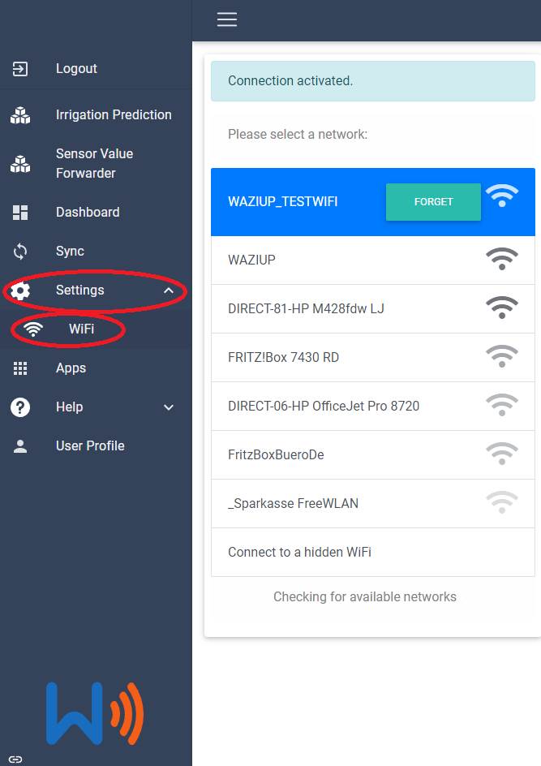

## Setup the WaziGate

The Wazigate is a LoRa Gateway. It is the connecting link between your sensor devices and the WaziCloud platform. It merges and stores all the sensor values and also can run custom applications.

The Gateway has been prepared for you, so all essential settings like creating devices and setting up the LoRa part has been done. The only thing that is left is to connect it to your local area network. For that purpose the WaziGate will create a Wifi-Hotspot, that you can connect with your smartphone, pc or tablet. 

### Connect a WaziGate to a local network:

1. Power the WaziGate with the delivered power supply and wait for 3min.
2. Connect to a WIFI with the following SSID: "WAZIGATE_XXXXXXXXX" (X is arbitrary). The password for this network is "loragateway". Your device may state that this network has no internet connection, but connect anyways.
3. Open the browser of your choice, type the address [http://10.42.0.1](http://10.42.0.1) as URL and hit enter or scan this QR code. 
4. The login screen of the WaziGate is shown. Use the following credentials:
    - Username: admin
    - Password: loragateway
5. Next step is to connect to a local Wifi with internet access: Go to Settings -> Wifi. The WaziGate will now scan for local networks nearby.

6. To connect to your Wifi, you have to issue the password of your network.
7. After connecting, the UI is not any more responsive and the access point of the WaziGate will be closed. Now connect your device (smartphone, pc or tablet) to the same network like you formerly connected your WaziGate.
8. Now you can access the WaziGate via the IP-address, via the alias [http://wazigate.local](http://wazigate.local) or scan this QR code.  

The last two options are only available if there is only one WaziGate connected to the same Wifi network.

This is it, we are ready!

## Troubleshooting

If you have any further questions/problems, please do not hesitate to contact us.
You can reach out to us at contact@waziup.org. 