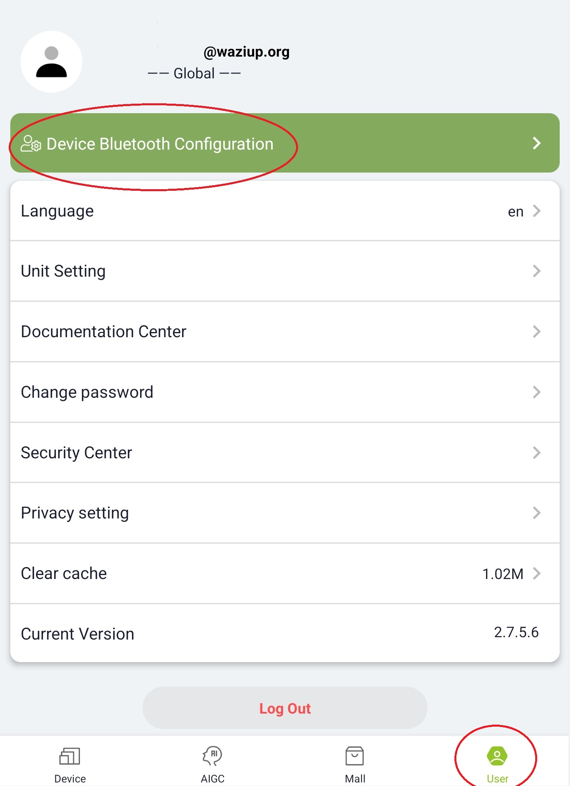
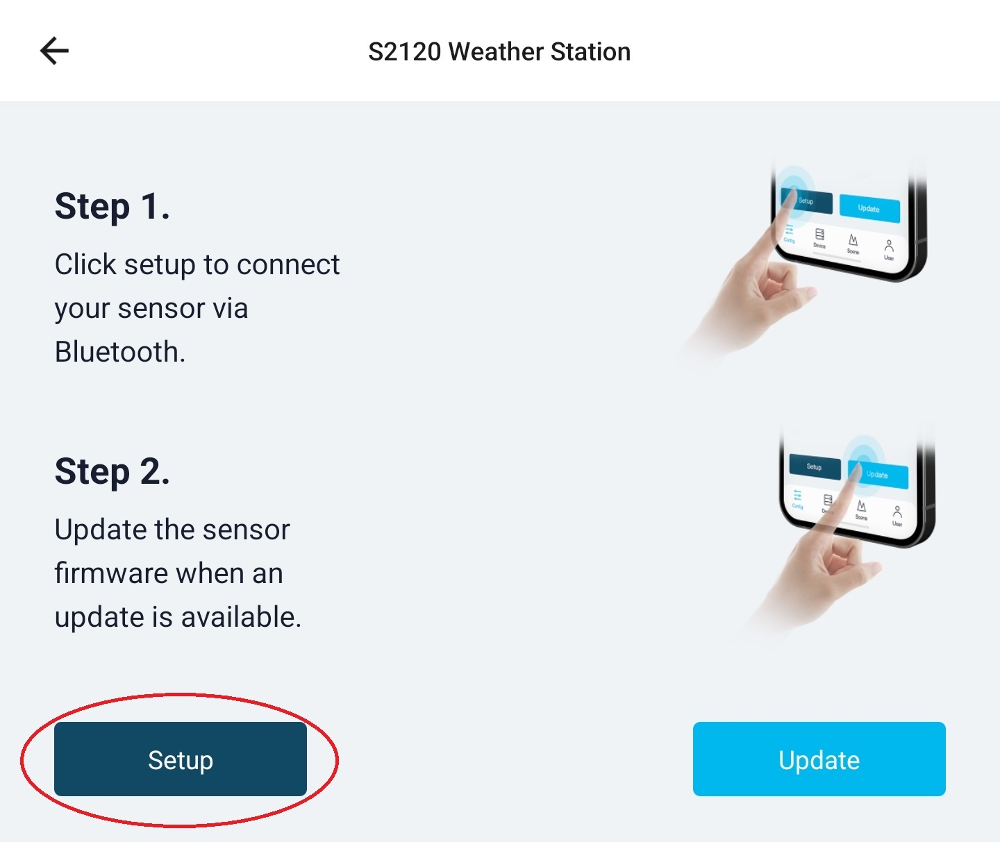
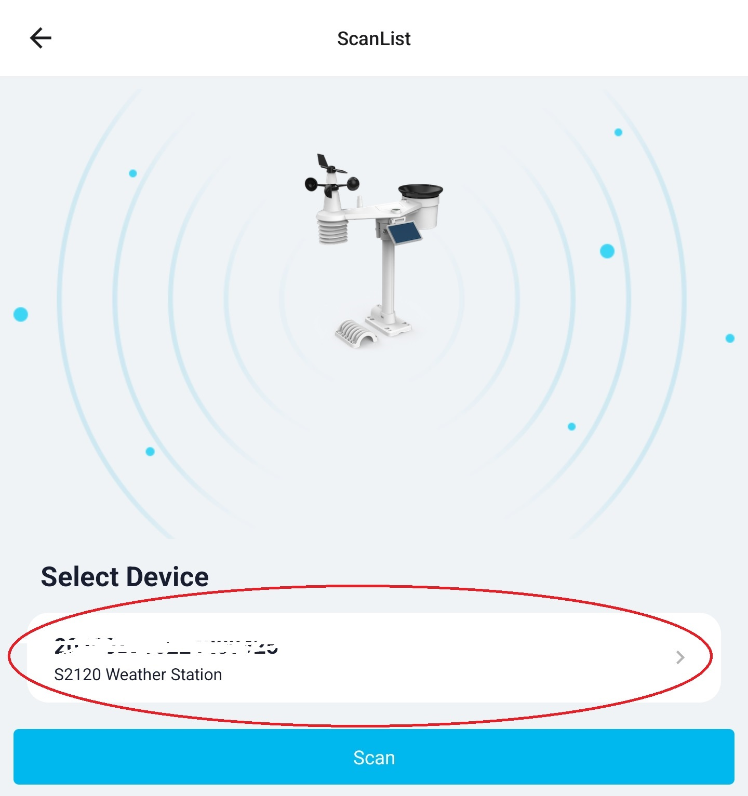
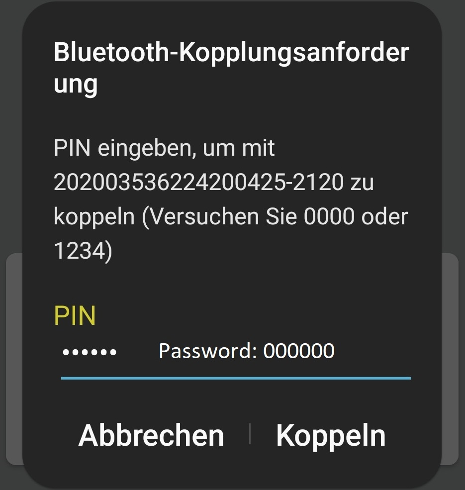
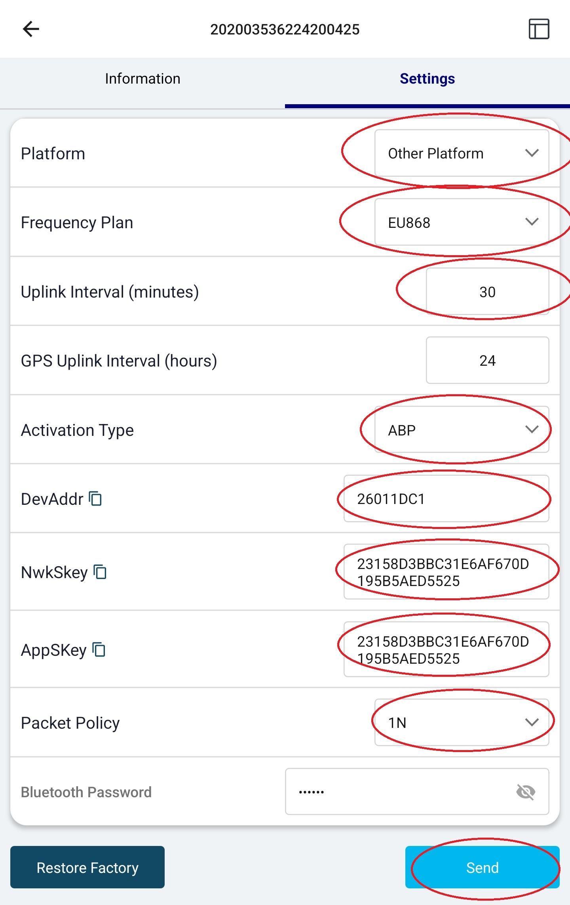
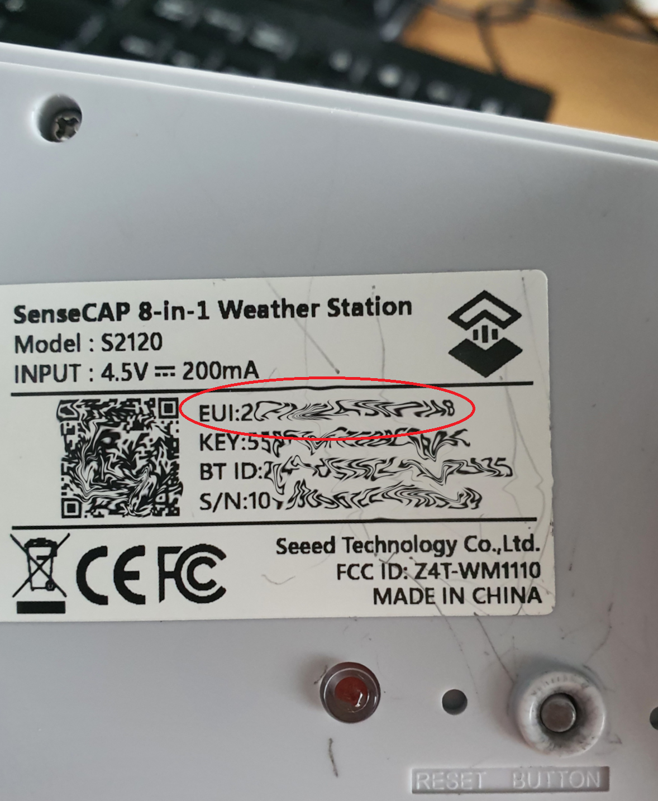
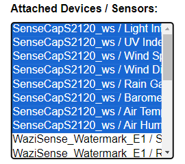
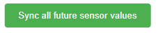

#  Deploy a WaziGate with SenseCap S2120 Weather Station

In the following the procedure of connecting the [Seeedstudio SenseCap S2120 weather station](https://files.seeedstudio.com/products/SenseCAP/101990961_SenseCAP%20S2120/SenseCAP%20S2120%20LoRaWAN%208-in-1%20Weather%20Station%20User%20Guide.pdf) to the WaziGate is explained. The guide will be structured into several steps:

## Structure
1. Prepare the [Seeedstudio SenseCap S2120 weather station](https://files.seeedstudio.com/products/SenseCAP/101990961_SenseCAP%20S2120/SenseCAP%20S2120%20LoRaWAN%208-in-1%20Weather%20Station%20User%20Guide.pdf)
2. Prepare the Gateway (WaziGate)
3. Setup the application [waziup/sensor-value-forwarder](https://hub.docker.com/r/waziup/sensor-value-forwarder) for WaziGate

## Prepare the Weather Station

In the following there are the steps explained to change the connection settings of the SenseCap weather station. It is done by using an Android or iOS app. The name of the App is SenseCap, you will find it in [PlayStore](https://play.google.com/store/apps/details?id=cc.seeed.sensecapmate&hl=en&gl=US) or [AppStore](https://apps.apple.com/gb/app/sensecap-mate/id1619944834).

Additional information about the weather station can be found in the [official guide](https://files.seeedstudio.com/products/SenseCAP/101990961_SenseCAP%20S2120/SenseCAP%20S2120%20LoRaWAN%208-in-1%20Weather%20Station%20User%20Guide.pdf). The weather station is not preassembled delivered, to physically setup the hardware please consult the [official guide](https://files.seeedstudio.com/products/SenseCAP/101990961_SenseCAP%20S2120/SenseCAP%20S2120%20LoRaWAN%208-in-1%20Weather%20Station%20User%20Guide.pdf).

After setting up the weather station, you can make a connection to the sensor, it is done via bluetooth, so you need to be in close proximity (10m) to the weather station.

### Steps to configure the Weather Station 

1. Download and open the application, follow the instructions on screen.

2. Connect to the weather station via bluetooth

3. Select the weather station device to start the configuration. For SenseCap S2120: select "SENSECAP S2120" from the list of available devices.

4. In the next screen choose "Setup" / press the "Setup" button.

5. Select the device from the list that you aim to configure.

6. Connect to the device with the pin. The default pin is: 000000 You can change this later.

7. Change LoRa connection settings of weather station accordingly.

### Settings to be changed:

| Parameter                 | Value                            |
|---------------------------|----------------------------------|
| Platform                  | Other Platform                   |
| Frequency Plan            | EU868                            |
| Uplink Interval (minutes) | 30                               |
| Activation Type           | ABP                              |
| DevAddr                   | 26011DC1                         |
| NwkSkey                   | 23158D3BBC31E6AF670D195B5AED5525 |
| Packet Policy             | 1N                               |

You can also change the Bluetooth Password, if necessary. Everyone with the App installed and in proximity can change your configuration.

***WARNING***: All Gateways had been prepared using the same LoRa connection credentials. If you intend to deploy two weather stations in close proximity (below 20km), you have to change the DevAddr. Those changes also have to be conducted in the WaziGate, where those respective devices are already created for you.

Great, now the weather station is prepared. Good job! Next step is to prepare the WaziGate.

## Setup the WaziGate

The Wazigate is a LoRa Gateway. It is the connecting link between your sensor devices and the WaziCloud platform. It merges and stores all the sensor values and also can run custom applications.

The Gateway has been prepared for you, so all essential settings like creating devices and setting up the LoRa part has been done. The only thing that is left is to connect it to your local area network. For that purpose the WaziGate will create a Wifi-Hotspot, that you can connect with your smartphone, pc or tablet. 

### Steps:

1. Power the WaziGate with the delivered power supply and wait for 3min.
2. Connect to a WIFI with the following SSID: "WAZIGATE_XXXXXXXXX" (X is arbitrary)
3. Open the browser of your choice, type the address [http://42.10.0.1](http://42.10.0.1) as URL and hit enter.
4. The login screen of the WaziGate is shown. Use the following credentials:
    - Username: admin
    - Password: loragateway
5. Next step is to connect to a local Wifi with internet access: Go to Settings -> Wifi. The WaziGate will now scan for local networks nearby.

6. To connect to your Wifi, you have to issue the password of your network.
7. After connecting, the UI is not any more responsive and the access point of the WaziGate will be closed. Now connect your device (smartphone, pc or tablet) to the same network like you formerly connected your WaziGate.
8. Now you can access the WaziGate via the IP-address or [http://wazigate.local](http://wazigate.local).

This is it, we are ready! In the next step we will setup the waziup/sensor-value-forwarder application.

## Setup the Sensor Value Forwarder Application for the WaziGate

Part of our project is to forward the captured sensor values of the weather station to our partners database.
For that purpose an application was developed to facilitate this procedure in an easy manner.

### Steps:

1. Open the Web-UI of your Gateway (IP-address or [http://wazigate.local](http://wazigate.local))
2. In the side bar on top you will see the "sensor value forwarder" option. Click it to start the custom application.
3. The application is just one page, you will have to provide some information to make it work. It is explained in the following:

| Parameter                | Value                                                                                                   |
|--------------------------|---------------------------------------------------------------------------------------------------------|
| URL                      | http://urbane-middleware.northeurope.cloudapp.azure.com:8443/iotsensor/weather                          |
| Username                 | urbane                                                                                                  |
| Password                 | J^!Z]ON*MiF8LU1x>V0dK\|rs                                                                               |
| Sensor ID                | You have to take the EUI from your weather station.                                   |
| GPS location             | Open a maps and copy geo coordinates of the location of the weather station, e.g.: 51.023591, 13.744087 |
| Temporal threshold       | 10                                                                                                      |
| Attached Devices/Sensors | Select all sensors with "SenseCapS2120" in the name. To select multiple devices press [CTL]-key.        |

4. If you provided all information, click on the green button in the bottom "Sync all future values".  A popup will confirm the synchronization.

Now you are set and done. All future sensor values will be synced with the endpoint. If you open the app again, all given inputs will be deleted, but the app is still synchronizing sensor values.

## Troubleshooting

If you have any further questions/problems, please do not hesitate to contact us.
You can reach out to us at contact@waziup.org. 